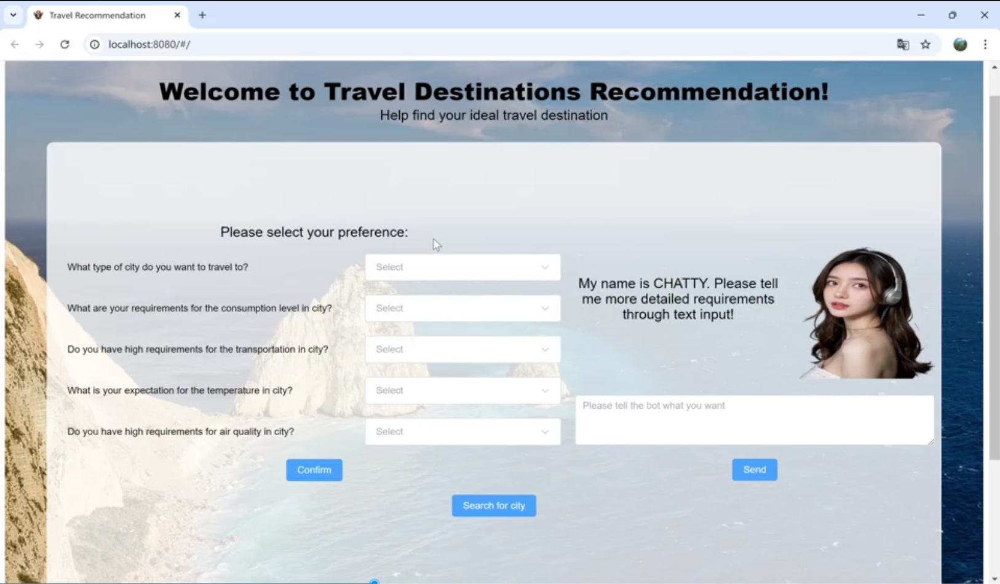

### <<<<<<<<<<<<<<<<<<<< Start of Project >>>>>>>>>>>>>>>>>>>>

---

## SECTION 1 : Travel Destinations Recommendation System -- TDRS

---

## SECTION 2 : EXECUTIVE SUMMARY / PAPER ABSTRACT
In today's digital age, travelers are constantly seeking personalized experiences to make their journeys memorable. The Travel Recommendation System (TRS) aims to address this demand by leveraging advanced algorithms and data analytics to provide customized travel suggestions. This system analyzes various data points from public dataset, including weather, cost of living index, and city type to offer tailored recommendations for destinations. By integrating existing evaluations and machine reasoning techniques, the TRS adapts to deliver more accurate and relevant suggestions over time. Besides to choosing from preset tags, our system supports natural language input by users. This function enable users to describe the expect destination to include more specific and personalized cases. This project not only enhances user satisfaction but also helps travel businesses optimize their offerings, ultimately contributing to a more engaging and efficient travel planning experience.
However, due to the limit time and resources, our system still has room for improvement. We will discuss the it in the "Future Improvement" section.

---

## SECTION 3 : CREDITS / PROJECT CONTRIBUTION

| Official Full Name  | Student ID (MTech Applicable)  | Work Items (Who Did What) | Email (Optional) |
| :------------ |:---------------:| :-----| :-----|
| LONG ZHEN  | A0297168L | Model Training, Algorithm Design| A0297168L@u.nus.edu |
| ZHOU YUKANG  | A0296841R | Back-end Development, Chatbot Design| A0296841R@u.nus.edu |
| TAO ZHEN | A0296066U | Data Collection, Data Washing, Report and Presentation| A0296066U@u.nus.edu |
| AN DONGQI | A0296362W | Front-end Development, Reasoning Logic Design| A0296362W@u.nus.edu |

---

## SECTION 4 : VIDEO OF SYSTEM MODELLING & USE CASE DEMO

`Refer to videos at Github Folder: Video`

---

## SECTION 5 : USER GUIDE

`Refer to appendix <Installation & User Guide> in project report at Github Folder: ProjectReport`

### Run the system directly (recommended):

> download travelRecommendation.zip in Releases and unzip

> open the terminal in the directory containing "_internal" and "travelRecommendation.exe"

> .\travelRecommendation.exe runserver 127.0.0.1:8080 --noreload

> Go to URL using web browser http://127.0.0.1:8080/

### To run the system in other/local machine:

> git clone https://github.com/ffffffklj/IRS-PM-2024-08-26-IS02PT-GRP-RushB-Travel-Destinations-Recommendation-System-TDRS-.git

> open files in the following path:

> IRS-PM-2024-08-26-IS02PT-GRP-RushB-Travel-Destinations-Recommendation-System-TDRS- --> SystemCode --> travelRecommendation

> install necessary libraries and RUN

> open files in the following path:

> IRS-PM-2024-08-26-IS02PT-GRP-RushB-Travel-Destinations-Recommendation-System-TDRS- --> SystemCode --> recommendationTravel

> npm install

> npm run serve

> Go to URL using web browser http://127.0.0.1:8080/
---
## SECTION 6 : PROJECT REPORT / PAPER

`Refer to project report at Github Folder: ProjectReport`

### <<<<<<<<<<<<<<<<<<<< End of Project >>>>>>>>>>>>>>>>>>>>

---

**This [Machine Reasoning (MR)](https://www.iss.nus.edu.sg/executive-education/course/detail/machine-reasoning "Machine Reasoning") course is part of the Analytics and Intelligent Systems and Graduate Certificate in [Intelligent Reasoning Systems (IRS)](https://www.iss.nus.edu.sg/stackable-certificate-programmes/intelligent-systems "Intelligent Reasoning Systems") series offered by [NUS-ISS](https://www.iss.nus.edu.sg "Institute of Systems Science, National University of Singapore").**

**Lecturer: [GU Zhan (Sam)](https://www.iss.nus.edu.sg/about-us/staff/detail/201/GU%20Zhan "GU Zhan (Sam)")**

**zhan.gu@nus.edu.sg**
