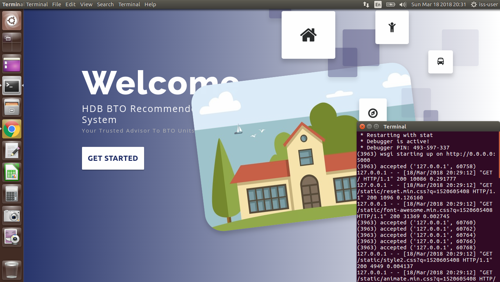

### [ Practice Module ] Project Submission Template: Github Repository & Zip File

**[ Naming Convention ]** CourseCode-StartDate-BatchCode-TeamName-ProjectName.zip

* **[ MTech Thru-Train Group Project Naming Example ]** IRS-PM-2020-01-18-IS02PT-GRP-AwsomeSG-HDB_BTO_Recommender.zip

* **[ MTech Stackable Group Project Naming Example ]** IRS-PM-2020-01-18-STK02-GRP-AwsomeSG-HDB_BTO_Recommender.zip

[Online editor for this README.md markdown file](https://pandao.github.io/editor.md/en.html "pandao")

---

### <<<<<<<<<<<<<<<<<<<< Start of Template >>>>>>>>>>>>>>>>>>>>

---

## SECTION 1 : PROJECT TITLE
## Travel Destinations Recommendation System -- TDRS

---

## SECTION 2 : EXECUTIVE SUMMARY / PAPER ABSTRACT
In today's digital age, travelers are constantly seeking personalized experiences to make their journeys memorable. The Travel Recommendation System (TRS) aims to address this demand by leveraging advanced algorithms and data analytics to provide customized travel suggestions. This system analyzes various data points, including tourists’ evaluations, users’ past behavior, and current trends, to offer tailored recommendations for destinations. By integrating existing evaluations and machine reasoning techniques, the TRS adapts to deliver more accurate and relevant suggestions over time. This project not only enhances user satisfaction but also helps travel businesses optimize their offerings, ultimately contributing to a more engaging and efficient travel planning experience.

---

## SECTION 3 : CREDITS / PROJECT CONTRIBUTION

| Official Full Name  | Student ID (MTech Applicable)  | Work Items (Who Did What) | Email (Optional) |
| :------------ |:---------------:| :-----| :-----|
| LONG ZHEN  | A0297168L | xxxxxxxxxx yyyyyyyyyy zzzzzzzzzz| A0297168L@nus.edu.sg |
| ZHOU YUKANG  | A0296841R | xxxxxxxxxx yyyyyyyyyy zzzzzzzzzz| A0296841R@nus.edu.sg |
| TAO ZHEN | A0296066U | xxxxxxxxxx yyyyyyyyyy zzzzzzzzzz| A0296066U@nus.edu.sg |
| AN DONGQI | A0296362W | xxxxxxxxxx yyyyyyyyyy zzzzzzzzzz| A0296362W@nus.edu.sg |

---

## SECTION 4 : VIDEO OF SYSTEM MODELLING & USE CASE DEMO

Note: It is not mandatory for every project member to appear in video presentation; Presentation by one project member is acceptable. 
More reference video presentations [here](https://telescopeuser.wordpress.com/2018/03/31/master-of-technology-solution-know-how-video-index-2/ "video presentations")

---

## SECTION 5 : USER GUIDE

`Refer to appendix <Installation & User Guide> in project report at Github Folder: ProjectReport`

### [ 1 ] To run the system using iss-vm

> download pre-built virtual machine from http://bit.ly/iss-vm

> start iss-vm

> open terminal in iss-vm

> $ git clone https://github.com/telescopeuser/Workshop-Project-Submission-Template.git

> $ source activate iss-env-py2

> (iss-env-py2) $ cd Workshop-Project-Submission-Template/SystemCode/clips

> (iss-env-py2) $ python app.py

> **Go to URL using web browser** http://0.0.0.0:5000 or http://127.0.0.1:5000

### [ 2 ] To run the system in other/local machine:
### Install additional necessary libraries. This application works in python 2 only.

> $ sudo apt-get install python-clips clips build-essential libssl-dev libffi-dev python-dev python-pip

> $ pip install pyclips flask flask-socketio eventlet simplejson pandas

---
## SECTION 6 : PROJECT REPORT / PAPER

`Refer to project report at Github Folder: ProjectReport`

**Recommended Sections for Project Report / Paper:**
- Executive Summary / Paper Abstract
- Sponsor Company Introduction (if applicable)
- Business Problem Background
- Market Research
- Project Objectives & Success Measurements
- Project Solution (To detail domain modelling & system design.)
- Project Implementation (To detail system development & testing approach.)
- Project Performance & Validation (To prove project objectives are met.)
- Project Conclusions: Findings & Recommendation
- Appendix of report: Project Proposal
- Appendix of report: Mapped System Functionalities against knowledge, techniques and skills of modular courses: MR, RS, CGS
- Appendix of report: Installation and User Guide
- Appendix of report: 1-2 pages individual project report per project member, including: Individual reflection of project journey: (1) personal contribution to group project (2) what learnt is most useful for you (3) how you can apply the knowledge and skills in other situations or your workplaces
- Appendix of report: List of Abbreviations (if applicable)
- Appendix of report: References (if applicable)

---
## SECTION 7 : MISCELLANEOUS

`Refer to Github Folder: Miscellaneous`

### HDB_BTO_SURVEY.xlsx
* Results of survey
* Insights derived, which were subsequently used in our system

---

### <<<<<<<<<<<<<<<<<<<< End of Template >>>>>>>>>>>>>>>>>>>>

---

**This [Machine Reasoning (MR)](https://www.iss.nus.edu.sg/executive-education/course/detail/machine-reasoning "Machine Reasoning") course is part of the Analytics and Intelligent Systems and Graduate Certificate in [Intelligent Reasoning Systems (IRS)](https://www.iss.nus.edu.sg/stackable-certificate-programmes/intelligent-systems "Intelligent Reasoning Systems") series offered by [NUS-ISS](https://www.iss.nus.edu.sg "Institute of Systems Science, National University of Singapore").**

**Lecturer: [GU Zhan (Sam)](https://www.iss.nus.edu.sg/about-us/staff/detail/201/GU%20Zhan "GU Zhan (Sam)")**

**zhan.gu@nus.edu.sg**
